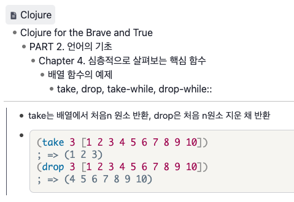

### Day 4

I didn't have time today...
but I solved the 4clojure problem with the idea that I should not be lazy.

What I did today?
  - 4Clojure No.24 Solved

### Day 5

Today I read up to Chapter 4's <Array function example>

and I made a flashcard about Clojure's core functions
because I think the core functions have to pop out of my brain reflexively when needed.

4clojure
 - No.25 solved
 - No.26 solved (Recursive thinking was difficult.)

